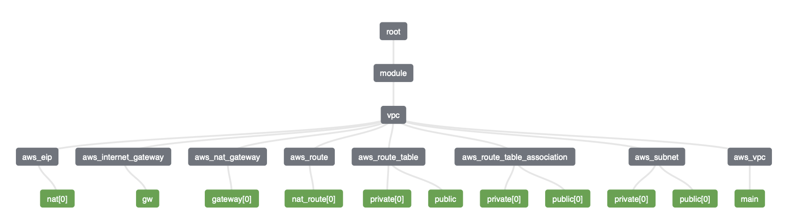
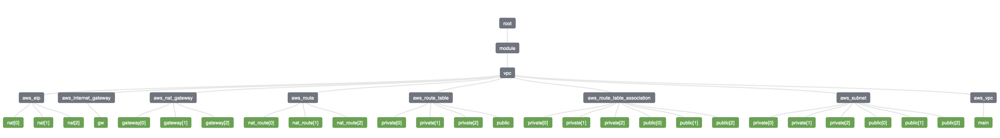

# AWS VPC Terraform Module

Modular Terraform configuration that provisions an AWS Virtual Private Cloud (VPC) with public and private subnets, internet egress, and optional high-availability NAT gateways. The module supports both single-Availability Zone and multi-Availability Zone topologies, making it a reusable foundation for infrastructure projects.

## Highlights

- Creates a VPC, public and private subnets, routing, and egress components in one apply.
- Switches between single-AZ and multi-AZ deployments with a boolean flag.
- Supports one shared NAT Gateway (cost-optimized) or one per AZ (high availability).
- Allows custom CIDR blocks, AZ selections, and resource naming.
- Exposes outputs for downstream modules (subnet IDs, NAT IDs, and more).

## Repository Layout

- `main.tf` roots the example deployment in `eu-central-1` and consumes the module.
- `modules/awsvpc` contains the reusable module logic and variable definitions.
- `TerraformVisual/` holds topology diagrams and Terraform plan outputs for reference.
- `output.tf` surfaces the module outputs from the example configuration.

## Prerequisites

- Terraform 1.5.7 or newer (module tested with Terraform 1.5.7).
- AWS credentials exported in your shell or configured through the AWS CLI.
- Appropriate IAM permissions to create networking resources (VPC, subnets, EIPs, NAT, IGW).

## Quick Start

- `terraform init` to download providers and configure the backend.
- `terraform plan` to review the changes in your target account.
- `terraform apply` to create the VPC (answer `yes` when prompted).
- `terraform destroy` when you want to remove all provisioned resources.

## Example Usage

```hcl
provider "aws" {
  region = "eu-central-1"
}

module "vpc" {
  source              = "./modules/awsvpc"
  vpc_name            = "platform-vpc"
  vpc_cidr            = "10.0.0.0/16"
  single_az           = false
  availability_zones  = ["eu-central-1a", "eu-central-1b", "eu-central-1c"]
  egress_multi_nat_gw = true
}
```

- Set `single_az = true` to restrict the deployment to the first AZ in `availability_zones`.
- Toggle `egress_multi_nat_gw` to control whether a NAT Gateway is created per public subnet.

## Configuration Reference

| Input | Description | Type | Default |
| --- | --- | --- | --- |
| `vpc_name` | Name tag applied to the VPC resource. | `string` | `"VPC-test1"` |
| `vpc_cidr` | Base CIDR block for the VPC (supports `/16`). | `string` | `"10.0.0.0/16"` |
| `single_az` | Deploy a single-AZ topology when `true`. | `bool` | `true` |
| `availability_zones` | Ordered list of AZs used for subnet placement. | `list(string)` | `["eu-central-1a", "eu-central-1b", "eu-central-1c"]` |
| `egress_multi_nat_gw` | Create a NAT Gateway per public subnet when `true`. | `bool` | `false` |

| Output | Description |
| --- | --- |
| `vpc_id` | Identifier of the created VPC. |
| `subnet_ids` | Map containing lists of public and private subnet IDs. |
| `public_subnet_ids` | List of IDs for every public subnet. |
| `private_subnet_ids` | List of IDs for every private subnet. |
| `internet_gateway_id` | ID of the provisioned Internet Gateway. |
| `nat_gateway_ids` | List of NAT Gateway IDs created by the deployment. |

## Architecture Modes

- **Single AZ:** Creates one `/24` public subnet and one `/19` private subnet in the first AZ supplied. Internet access for private workloads is routed through a single NAT Gateway.  
  
- **Multi AZ:** Creates a pair of public/private subnets in each AZ listed. NAT egress scales from one shared gateway to one per AZ depending on `egress_multi_nat_gw`.  
  

## NAT Gateway Strategies

- **Cost optimized:** Keep `egress_multi_nat_gw = false` to deploy one NAT Gateway regardless of the number of AZs.
- **High availability:** Set `egress_multi_nat_gw = true` to match the number of NAT Gateways to the number of public subnets.
- Remember that NAT Gateways incur hourly and data processing charges; destroy unused environments to limit spend.

## Troubleshooting Tips

- Ensure the `availability_zones` list matches the selected AWS region; invalid AZ labels cause planning errors.
- When changing between single-AZ and multi-AZ modes, run `terraform apply` twice if Terraform needs to recreate route associations.
- Use `terraform state list` to inspect created resources when debugging or before destroying the stack.

## License

Licensed under the Apache 2.0 License. See `LICENSE` for full details.
